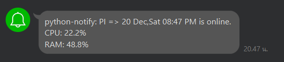
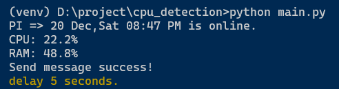

#### Python line notify

how to install:

1. `pip3 install -r requirements.txt`
2. edit `settings.json` or run `python3 main.py` and put line token and device name
3. set interval in setting.json (default 3600 seconds or 1 hr.)
4. set log in setting.json (default false) if true program will genarate app.log and put status message and computer status to app.log.

##### It works pretty for me, I'm testing on the Windows 10 and Raspbian Linux (Raspberry PI 4)

##### line

##### terminal log

